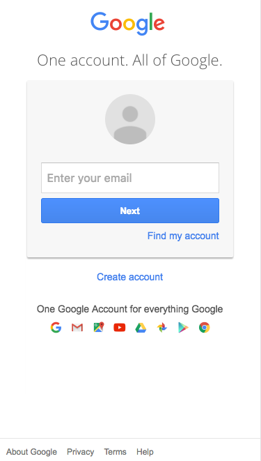
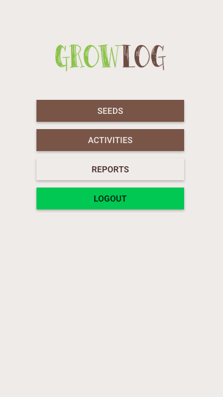
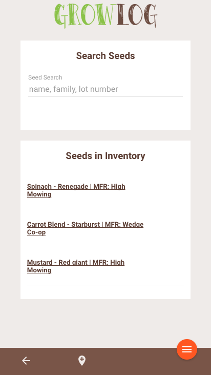
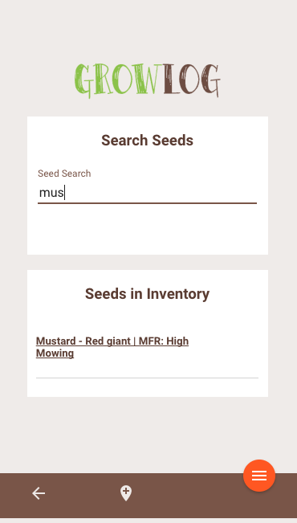
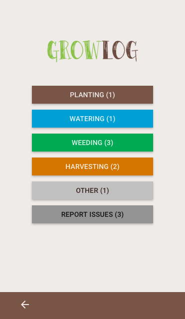

# <a name="top">GrowLog</a>
GrowLog is an application that allows gardeners to track and manage the lifecycle of their plants from seed purchase to harvest. It features a searchable seed inventory, the ability to schedule gardening activities, and the ability to generate reports.

GrowLog was built for our final group project and is the culmination of our time [@PrimeAcademy](https://github.com/PrimeAcademy). Our group worked with the client, Page & Flowers, to create a real-world solution for their urban farming tracking needs. Over the course of three weeks, we worked collaboratively to define the scope of work, build a fully functioning web application, and present our solution to over 150 people.

Check out [GrowLog here](https://blooming-anchorage-93223.herokuapp.com/)

## Features
[Login](#login) | [Homepage](#homepage) | [Seeds](#seeds) | [Activities](#activities) | [Reports](#reports) | [Setup](#setup) | [Tech Used](#tech) | [Authors](#authors)

### <a name="login">Login</a>

For easy access, a user can login using their Gmail account.

### <a name="homepage">GrowLog Homepage</a>
The landing page after logging in.

### <a name="seeds">Seeds</a>
Add, edit, complete and delete information about seed inventory using the searchable database.

### <a name="activities">Activities</a>
Add, edit, complete and delete planting, watering, weeding, harvesting, and other activities or issues (such as pests) happening out in the field.

## <a name="setup">Set-up</a>

__Google OAuth Instructions:__  
Go to *https://console.developers.google.com*, create a new project,   
Create a **.env** file which includes the following information:  
AUTHORIZATION_URL, TOKEN_URL, CLIENT_ID, CLIENT_SECRET, CALLBACK_URL, and SECRET   

__General Operating Instructions:__   
- Run *npm install* in the terminal to download dependencies listed in package.json  
- PostgreSQL database setup information can be found in **database.sql**  
- Type *npm start* in the terminal to start the server connection  
- Enter *localhost:3000* in the browser address bar  
- Type *Control + C* in the terminal to quit the server connection

### Or visit GrowLog on Heroku at https://blooming-anchorage-93223.herokuapp.com/

## <a name="tech">Technologies Used</a>
AngularJS 1.5.8
Angular Material
Expressjs 4.14.0
Heroku
jQuery 3.1.1  
Knexjs 0.12.6  
Momentjs 2.16.0
Nodejs
Passport-google-oauth2 0.1.6  
PostgreSQL 6.1.0

# <a name="authors">Authors</a>
- Laura Abend  
- Ally Boyd  
- Elisa Lee  
- Jackie Torborg  
- Alexander Whitaker

Back to [top](#top)
